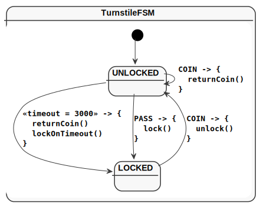

= KFSM Android Demo

A simple application to demonstrate implementing link:https://github.com/open-jumpco/kfsm[KFSM] with the classic Turnstile FSM.

== Generated State Diagram

=== Simple Diagram

=== Detail Diagram

== Generated State Table

=== TurnstileFSM State Map

|===
| Start | Event[Guard] | Target | Action

| LOCKED
| COIN
| UNLOCKED
a| [source,kotlin]
----
{
unlock()
}
----

| UNLOCKED
| \<<timeout = 3000>>
| LOCKED
a| [source,kotlin]
----
{
lockOnTimeout()
}
----

| UNLOCKED
| PASS
| LOCKED
a| [source,kotlin]
----
{
lock()
}
----

| UNLOCKED
| COIN
| UNLOCKED
a| [source,kotlin]
----
{
returnCoin()
}
----
|===

To learn more about visualization visit link:https://github.com/open-jumpco/kfsm-viz[kfsm-viz] and
link:https://github.com/open-jumpco/kfsm-viz-plugin[kfsm-viz-plugin]
